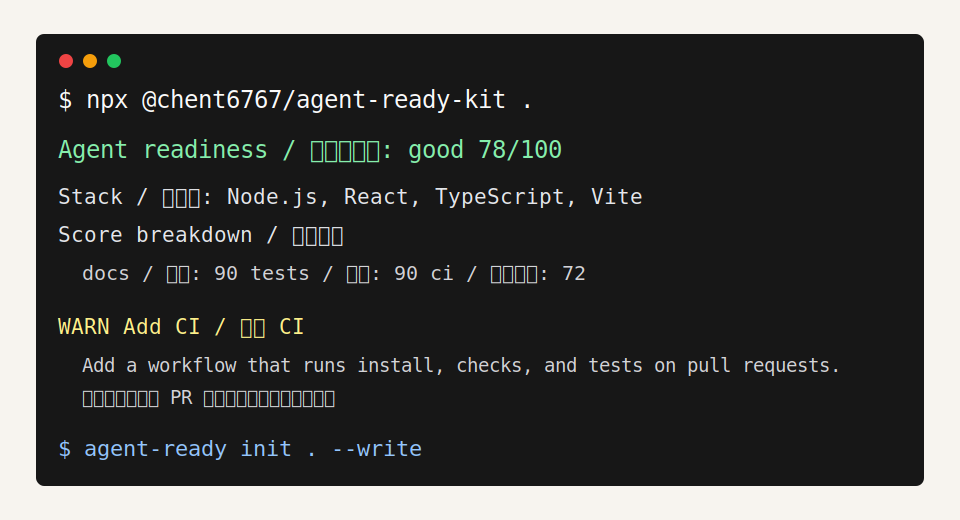

# agent-ready-kit

[](README.md)
[](https://github.com/chen9965/agent-ready-kit/actions/workflows/ci.yml)
[](LICENSE)
[](package.json)

**Make a repository easier for AI coding agents to understand, edit, and verify.**

**让仓库更适合 Codex、Claude Code、Cursor、Copilot coding agent 这类 AI 编码代理接手。**

`agent-ready-kit` is a local CLI and GitHub Action. It scans a repository for the things an AI coding agent needs before changing code: setup commands, tests, CI, repo map, safety boundaries, and `AGENTS.md`.

`agent-ready-kit` 是一个本地 CLI 和 GitHub Action。它会检查一个仓库有没有把 AI 编码代理最需要的信息写清楚：怎么安装、怎么测试、CI 是否存在、目录结构是否清楚、哪些边界不能乱碰、有没有 `AGENTS.md`。

After scanning, it gives you a score and can generate the missing agent-facing files. For large repositories, `--out` also writes a portable artifact bundle: raw JSON, Markdown report, prioritized action plan, and a before/after explanation. The CLI first tries a maintainer-hosted managed LLM endpoint, so most users do not need to apply for a model key. If that endpoint is unavailable, advanced users can bring their own OpenAI-compatible key or run local-only.

扫描后，它会给仓库一个就绪度分数，并且可以生成 Agent 直接能看的说明文件和任务清单。针对大仓库，`--out` 还会落地一组可分享产物：原始 JSON、Markdown 报告、优先级行动计划和使用前后对比说明。CLI 会优先尝试维护者托管的大模型端点，所以大多数用户不需要自己申请模型 key；如果托管端点不可用，高级用户再配置自己的 OpenAI 兼容 key，或选择纯本地扫描。



## Real Repository Showcase / 真实仓库示例

Want to see what the tool finds on large real repositories?

想看它跑在真实大仓库上是什么效果？

See [docs/showcase](docs/showcase/README.md) for scans of React, Next.js, TypeScript, and Node.js.

查看 [docs/showcase](docs/showcase/README.md)，里面有 React、Next.js、TypeScript 和 Node.js 的真实扫描结果。

## What Problem Does It Solve / 解决什么问题

AI coding agents often fail for boring reasons:

- They cannot find the right install or test command.
- They do not know which folders are generated, risky, or off-limits.
- They miss the project structure and edit the wrong layer.
- Reviewers have to repeat the same safety and verification comments.

AI 编码代理经常不是因为模型不够强才出错，而是因为仓库没有把工作规则讲明白：

- 安装、构建、测试命令在哪里？
- 哪些目录是生成物、高风险区域或不要手改的内容？
- 项目结构是什么，应该优先看哪些文件？
- 改完以后要跑什么检查，PR 里应该怎么守住质量？

`agent-ready-kit` turns those missing rules into a visible checklist, score, report, and generated files.

`agent-ready-kit` 会把这些“没讲清的规则”变成可见的清单、分数、报告和生成文件。

## What You Get / 跑完会得到什么

| Output | What it is for | 中文说明 |
| --- | --- | --- |
| `Agent Ready Score` | A 0-100 score across docs, tests, scripts, CI, repo map, safety, and onboarding. | 从文档、测试、脚本、CI、仓库地图、安全、上手体验给出 0-100 分。 |
| `.agent-ready/scan.json` | Full machine-readable scan result for dashboards, CI, or comparisons. | 完整机器可读扫描结果，适合仪表盘、CI 或对比。 |
| `.agent-ready/before-after.md` | Explains what was unclear before the scan and what becomes visible after it. | 说明扫描前看不清什么、扫描后多了哪些可见信息。 |
| `.agent-ready/action-plan.md` | Prioritized fix plan grouped by severity. | 按严重程度整理的修复优先级计划。 |
| `AGENTS.md` | Repo-specific instructions for coding agents. | 给 AI 编码代理看的仓库说明书。 |
| `.agent-ready/report.md` | Bilingual readiness report with findings and fixes. | 双语就绪度报告，列出问题和修复建议。 |
| `.agent-ready/tasks/*.md` | Concrete task cards for improving weak spots. | 把薄弱项拆成可以执行的任务卡。 |
| `.agent-ready/guards.json` | Machine-readable guard rules for automation. | 机器可读的守护规则，方便接入自动化。 |
| GitHub Action gate | CI check that can fail PRs below a minimum score. | 在 PR 里设置最低就绪度门禁。 |
| Managed LLM recommendations | Zero-config model suggestions through a maintainer-hosted proxy, with BYOK fallback. | 通过维护者托管代理提供零配置模型建议，也支持用户自带 key 兜底。 |

## Quick Start / 快速开始

Scan the current repository:

扫描当前仓库：

```bash
cd your-repository
npx @chent6767/agent-ready-kit
```

Generate a shareable scan bundle:

生成可分享扫描产物：

```bash
npx @chent6767/agent-ready-kit . --out .agent-ready
```

Scan a GitHub repository directly:

直接输入 GitHub 仓库网址扫描：

```bash
npx @chent6767/agent-ready-kit https://github.com/chen9965/agent-ready-kit --out .agent-ready
```

LLM recommendations are attempted automatically through the managed endpoint. No model signup is needed for the common path.

大模型建议会自动优先走托管端点；普通用户不需要先注册模型平台。

```bash
npx @chent6767/agent-ready-kit .
```

Generate agent-facing files:

生成 Agent 可读文件：

```bash
npx @chent6767/agent-ready-kit init . --write
```

Open an HTML report:

打开本地 HTML 报告：

```bash
npx @chent6767/agent-ready-kit report . --open
```

GitHub source install also works:

也可以直接从 GitHub 源码运行：

```bash
npx github:chen9965/agent-ready-kit .
```

## Typical Workflow / 典型用法

1. Run `agent-ready .` to see why a repository is hard for agents to work in.
2. Run `init . --write` to generate `AGENTS.md`, task cards, guard rules, and a report.
3. Commit the useful generated files.
4. Add the GitHub Action gate so future PRs do not silently lose agent readiness.

1. 先运行 `agent-ready .`，看仓库为什么不适合 Agent 接手。
2. 再运行 `init . --write`，生成 `AGENTS.md`、任务卡、守护规则和报告。
3. 把有价值的生成文件提交到仓库。
4. 加上 GitHub Action 门禁，避免后续 PR 把 Agent 协作体验改坏。

## What It Checks / 它会检查什么

| Area | Signal examples | 中文说明 |
| --- | --- | --- |
| Docs | `README.md`, setup notes, project overview | 有没有基础文档、安装说明和项目介绍。 |
| Tests | test files, `package.json` test script, Python test files | 有没有测试文件或测试命令。 |
| Scripts | `build`, `test`, `check`, `dev`, package manager signals | 有没有明确的构建、测试、检查、开发脚本。 |
| CI | `.github/workflows/*` | PR 或主分支有没有自动验证。 |
| Repo map | repo map, architecture notes, structure sections | 有没有仓库地图或架构说明。 |
| Safety | `.gitignore`, possible secret-like files, large dense files | 有没有忽略规则、疑似密钥、高风险大文件。 |
| Onboarding | `AGENTS.md` and agent-specific rules | 有没有给 Agent 的工作说明。 |

The scanner reads repository shape, docs, scripts, and lightweight file evidence locally. For recommendations, it first tries the maintainer-hosted managed LLM endpoint. If that endpoint is unavailable, it falls back to local deterministic output and prints the command for using your own OpenAI-compatible key. It still does not claim to review every line like a full human reviewer.

扫描器会在本地读取仓库结构、文档、脚本和轻量文件证据。生成建议时，它会优先尝试维护者托管的大模型端点；如果端点不可用，会回退到本地确定性输出，并提示高级用户如何配置自己的 OpenAI 兼容 key。它仍然不会假装完整审查了每一行代码。

## Managed LLM Mode / 托管大模型模式

By default, `agent-ready-kit` sends bounded sampled code context to a maintainer-hosted proxy:

默认情况下，`agent-ready-kit` 会把有限采样代码上下文发送到维护者托管代理：

- file tree
- entrypoint candidates
- test candidates
- short excerpts from selected config/source files

它发送的内容包括：文件树、入口候选、测试候选，以及少量配置和源码片段。

It skips obvious secret-like paths and content. The public npm package never contains the maintainer's model key; that key must stay server-side in the managed proxy.

它会跳过明显像密钥的路径和内容。公开 npm 包里不会包含维护者的模型 key；真实 key 必须放在托管代理服务端。

Default managed endpoint:

默认托管端点：

```text
https://agent-ready-kit-llm.chen9965.workers.dev/v1/recommend
```

Use your own managed endpoint:

使用自己的托管端点：

```powershell
$env:AGENT_READY_LLM_MANAGED_URL="https://your-worker.example/v1/recommend"
npx @chent6767/agent-ready-kit .
```

Disable the managed proxy:

禁用托管代理：

```bash
npx @chent6767/agent-ready-kit . --no-managed-llm
npx @chent6767/agent-ready-kit . --no-llm
```

If the managed endpoint is unavailable, users can bring their own key:

如果托管端点不可用，用户可以再使用自己的 key：

```powershell
$env:AGENT_READY_LLM_API_KEY="your_openrouter_key"
npx @chent6767/agent-ready-kit . --markdown
```

Defaults:

默认值：

- `AGENT_READY_LLM_MANAGED_URL=https://agent-ready-kit-llm.chen9965.workers.dev/v1/recommend`
- `AGENT_READY_LLM_BASE_URL=https://openrouter.ai/api/v1`
- `AGENT_READY_LLM_MODEL=openrouter/free`

Mainland China-friendly preset:

国内更容易访问的预设：

```powershell
$env:AGENT_READY_LLM_PROVIDER="siliconflow"
$env:AGENT_READY_LLM_API_KEY="your_siliconflow_key"
npx @chent6767/agent-ready-kit .
```

This sets:

对应默认值：

- `AGENT_READY_LLM_BASE_URL=https://api.siliconflow.cn/v1`
- `AGENT_READY_LLM_MODEL=Qwen/Qwen3-8B`

You can override any OpenAI-compatible endpoint:

也可以接入任意 OpenAI 兼容服务：

```powershell
$env:AGENT_READY_LLM_BASE_URL="https://your-provider.example/v1"
$env:AGENT_READY_LLM_MODEL="provider/model-name"
$env:AGENT_READY_LLM_API_KEY="your_key"
npx @chent6767/agent-ready-kit .
```

Privacy controls:

隐私控制：

```bash
npx @chent6767/agent-ready-kit . --llm-summary
npx @chent6767/agent-ready-kit . --no-managed-llm
npx @chent6767/agent-ready-kit . --no-llm
npx @chent6767/agent-ready-kit . --llm-max-files 12 --llm-max-chars 18000
```

Maintainers can deploy the proxy template in [`examples/managed-llm-worker`](examples/managed-llm-worker/README.md).

维护者可以用 [`examples/managed-llm-worker`](examples/managed-llm-worker/README.md) 里的模板部署自己的代理。

## GitHub Action / GitHub Actions 用法

Add an agent-readiness gate to pull requests:

给 PR 加一个 AI 代理就绪度门禁：

```yaml
name: Agent Ready

on:
  pull_request:

jobs:
  score:
    runs-on: ubuntu-latest
    steps:
      - uses: actions/checkout@v4
      - uses: chen9965/agent-ready-kit@main
        with:
          min-score: 70
```

The action writes a bilingual Markdown report to the GitHub Actions step summary and fails when the score is below `min-score`.

Action 会在 GitHub Actions Step Summary 里写入双语报告；分数低于 `min-score` 时失败。

## Commands / 命令

| Command | What it does | 中文说明 |
| --- | --- | --- |
| `agent-ready [path]` | Scores docs, tests, scripts, CI, repo map, safety, and onboarding. | 为文档、测试、脚本、CI、仓库地图、安全和上手体验评分。 |
| `agent-ready https://github.com/owner/repo` | Clones a GitHub repository into a temp directory and scans it. | 自动浅克隆 GitHub 仓库到临时目录后扫描。 |
| `agent-ready [path] --out .agent-ready` | Writes `scan.json`, `report.md`, `before-after.md`, and `action-plan.md`. | 写入 `scan.json`、`report.md`、`before-after.md` 和 `action-plan.md`。 |
| `agent-ready [path] --markdown --fail-under 70` | Prints a Markdown report and exits with code 1 below a score. | 输出 Markdown 报告，低于指定分数时返回失败。 |
| `agent-ready [path] --no-managed-llm` | Skips the maintainer-hosted model proxy. | 跳过维护者托管模型代理。 |
| `agent-ready [path] --llm-summary` | Uses only scan summary for LLM recommendations. | 只把扫描摘要发给大模型。 |
| `agent-ready [path] --no-llm` | Forces deterministic local-only scanning. | 强制只做本地确定性扫描。 |
| `agent-ready init [path] --write` | Generates `AGENTS.md`, `.agent-ready/tasks/*.md`, `.agent-ready/guards.json`, and `.agent-ready/report.md`. | 生成代理说明、任务卡、守护规则和 Markdown 报告。 |
| `agent-ready report [path] --open` | Writes and opens a local HTML report. | 生成并打开本地 HTML 报告。 |

## Why This Is Useful / 优点在哪里

`agent-ready-kit` is useful when you want a repository to cooperate with AI tools instead of making them guess.

当你希望仓库能和 AI 工具配合，而不是让 Agent 盲猜时，这个工具就有价值。

- **Fast:** one command gives a score and concrete fixes.
- **Zero-config LLM path:** the CLI first tries a maintainer-hosted proxy, so users do not need a model account.
- **Local fallback:** users can still force deterministic scanning with `--no-llm`.
- **Agent-specific:** output is written for coding agents, not only human readers.
- **Actionable:** weak spots become task cards and guard rules.
- **CI-friendly:** the same score can become a pull request gate.
- **Provider-agnostic:** optional LLM mode works with OpenAI-compatible providers.

- **快：** 一条命令得到分数和修复方向。
- **零配置大模型路径：** CLI 优先尝试维护者托管代理，用户不需要先注册模型账号。
- **本地兜底：** 用户仍然可以用 `--no-llm` 强制只做确定性扫描。
- **面向 Agent：** 输出不是普通文档，而是给编码代理看的工作规则。
- **可执行：** 薄弱项会变成任务卡和 guard rules。
- **适合 CI：** 同一个分数可以变成 PR 门禁。
- **不绑模型：** 可选 LLM 模式兼容 OpenAI 风格接口。

## Before and After / 使用前后

Before:

- Agents guess setup commands.
- Agents miss repo boundaries and edit generated or risky files.
- Reviewers repeat the same "please run tests" and "do not touch this folder" comments.

使用前：

- Agent 只能猜安装和验证命令。
- Agent 容易错过仓库边界，改到生成物或高风险目录。
- Review 里反复出现“请跑测试”“别碰这个目录”。

After:

- `--out` writes `scan.json`, `report.md`, `before-after.md`, and `action-plan.md`.
- `AGENTS.md` gives repo-specific commands and working rules.
- `.agent-ready/tasks/` turns missing readiness into concrete work.
- `.agent-ready/guards.json` gives automation a stable policy shape.
- GitHub Actions can block low-readiness changes before they become team friction.

使用后：

- `--out` 直接写出 `scan.json`、`report.md`、`before-after.md` 和 `action-plan.md`。
- `AGENTS.md` 给出仓库专属命令和工作规则。
- `.agent-ready/tasks/` 把缺失能力变成具体任务。
- `.agent-ready/guards.json` 给自动化系统稳定策略格式。
- GitHub Actions 可以在低就绪度变成团队成本前先拦住。

## Example Output / 输出示例

```text
Agent readiness / 代理就绪度: good 78/100
Stack / 技术栈: Node.js, React, TypeScript, Vite

Top findings / 主要发现
WARN Add CI / 添加 CI
  Add a workflow that runs install, typecheck/lint, and tests on pull requests.
  添加工作流，在 PR 上运行安装、类型检查或 lint、测试。

Artifacts written / 扫描产物已生成: .agent-ready
- .agent-ready/scan.json
- .agent-ready/report.md
- .agent-ready/before-after.md
- .agent-ready/action-plan.md
```

## Comparison / 对比

| Tool type | Focus | agent-ready-kit difference | 区别 |
| --- | --- | --- | --- |
| Linter | Code style and syntax problems | Scores repository readiness for AI agents. | 关注 Agent 协作就绪度，而不只是代码风格。 |
| README generator | Human-facing documentation | Generates agent instructions, task cards, guard rules, reports, and CI gates together. | 同时生成代理说明、任务卡、守护规则、报告和 CI 门禁。 |
| AI wrapper | Calling a model | Scores repo readiness first, then uses managed LLM only for recommendations. | 先做仓库就绪度评分，再用托管大模型生成建议。 |
| Project template | Starting a new repo | Audits existing repositories and shows what is missing. | 可以审计已有仓库，指出还缺什么。 |

## Config / 配置

Create `agent-ready.config.json`:

创建 `agent-ready.config.json`：

```json
{
  "ignore": ["fixtures/**"],
  "agentTargets": ["Codex", "Claude Code", "Cursor"],
  "riskLevel": "medium",
  "outputDir": ".agent-ready"
}
```

## Development / 开发

```bash
npm install
npm run build
npm test
npm run smoke
```

## Roadmap / 路线图

- PR comment mode for richer review feedback.
- More stack detectors: Go, Rust, Java, .NET, Lua.
- JSON schema export for `guards.json`.
- VS Code task integration.

- PR 评论模式，让审查反馈更直接。
- 更多技术栈检测：Go、Rust、Java、.NET、Lua。
- 导出 `guards.json` 的 JSON Schema。
- VS Code task 集成。

## License / 许可证

MIT
